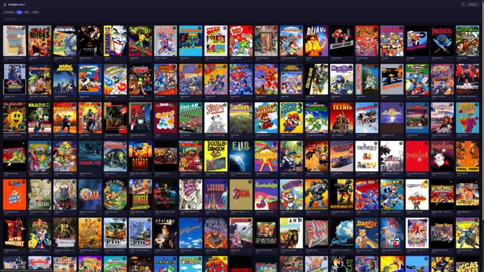
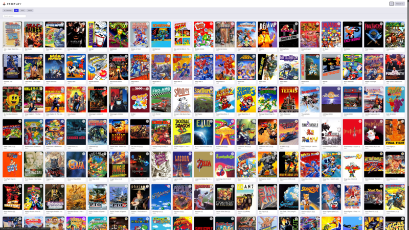

# Freeplay

A self-hosted retro gaming server. Point it at your ROMs, open a browser,
and play.

Freeplay wraps [EmulatorJS][] in a single Go binary with no external
dependencies. There's no database to provision, no background workers to
monitor, and no multi-container orchestration to debug. Install it, configure
a TOML file, and you're done.

## Screenshots

| Dark theme | Light theme |
|:----------:|:-----------:|
| [](.screenshots/dark.png) | [](.screenshots/light.png) |

## What it does

- Serves your ROM library through a browser-based emulator
- Persists save states and battery saves server-side
- Optionally fetches cover art from [IGDB][]
- Runs as a single binary or a single Docker container with one volume mount
- Light and dark themes (auto-detects system preference, with manual toggle)
- Responsive layout that works on mobile, tablet, and desktop
- Supports gamepad navigation in the library UI (D-pad to browse, shoulder
  buttons to switch filters, A/Start to launch)
- Keyboard-accessible — semantic HTML, visible focus indicators, skip
  navigation

## What it doesn't do

Freeplay is deliberately minimal. It has no:

- Database (no MariaDB, PostgreSQL, or Redis)
- User accounts, authentication, or role-based access
- Collections or wishlists
- ROM upload or metadata-editing UI
- Background job scheduler or cron tasks
- Multi-user support or sharing features
- OIDC, OAuth, or SSO integration

Your ROMs live on the filesystem. Freeplay reads them and gets out of your
way.

## Network security

Freeplay intentionally does not implement authentication. It is designed for
trusted environments like a home network or VPN, where every user on the
network is allowed to play.

## Quick start

```bash
# Copy and edit the example config
cp freeplay.example.toml /path/to/your/games/freeplay.toml

# Point docker-compose at your data directory and start
docker compose up --build
```

See [INSTALLING.md](INSTALLING.md) for detailed setup instructions, including
cover art configuration.

## Documentation

| Document                                       | Audience                           |
|------------------------------------------------|------------------------------------|
| [INSTALLING.md](INSTALLING.md)                 | Users setting up Freeplay          |
| [HACKING.md](HACKING.md)                       | Developers working on the codebase |
| [ARCHITECTURE.md](ARCHITECTURE.md)             | Understanding the internal design  |
| [freeplay.example.toml](freeplay.example.toml) | Annotated configuration reference  |

## Acknowledgements

Freeplay is a thin wrapper around [EmulatorJS][], which does all of the heavy
lifting. Thanks to the EmulatorJS team for making browser-based retro gaming
possible.

## License

MIT

[EmulatorJS]: https://github.com/EmulatorJS/EmulatorJS
[IGDB]: https://www.igdb.com/
