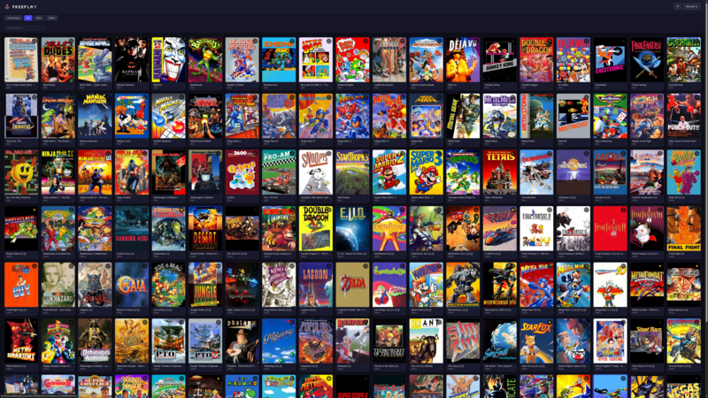
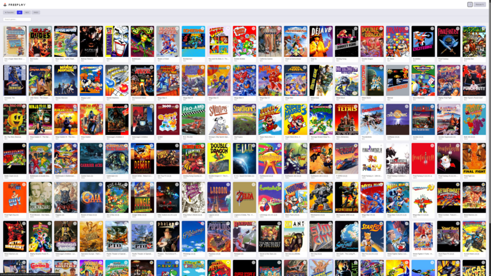

# 🕹️Freeplay

A self-hosted retro gaming server. Point it at your ROMs, open a browser,
and play.

Freeplay wraps [EmulatorJS][] in a single Go binary with no external
dependencies. There's no database to provision, no background workers to
monitor, and no multi-container orchestration to debug. Install it, configure
a TOML file, and you're done.

## Screenshots

| Dark theme | Light theme |
|:----------:|:-----------:|
| [](.screenshots/dark.png) | [](.screenshots/light.png) |

## What it does

- Serves your ROM library through a browser-based emulator
- Persists save states and battery saves server-side
- Optionally fetches cover art from [IGDB][]
- Shows a game details page with metadata, screenshots, and artwork from
  [IGDB][] (when configured)
- Serves per-game PDF manuals when placed alongside ROMs
- Filters games by console, favorites, or search query — search matches
  filename, IGDB title, developer, publisher, and release year; multi-word
  queries AND across all fields
- Runs as a single binary or a single Docker container with one volume mount
- Switches between light and dark themes (auto-detects system preference,
  with manual toggle)
- Adapts to mobile, tablet, and desktop screens
- Supports lightgun peripherals (SNES Super Scope, Justifier, and others)
- Supports gamepad navigation in the library UI (D-pad to browse, shoulder
  buttons to switch filters, A/Start to launch)
- Supports keyboard navigation — arrow keys to browse, `[`/`]` to cycle
  filters, semantic HTML, visible focus indicators

## What it doesn't do

Freeplay is deliberately minimal. It does not:

- Require a database (no MariaDB, PostgreSQL, or Redis)
- Manage user accounts, authentication, or roles
- Offer collections or wishlists
- Provide a ROM upload or metadata-editing UI
- Run background jobs or cron tasks
- Support multiple users or sharing features
- Integrate with OIDC, OAuth, or SSO

Your ROMs live on the filesystem. Freeplay reads them and gets out of your
way.

## Network security

Freeplay intentionally does not implement authentication. It is designed for
trusted environments like a home network or VPN, where every user on the
network is allowed to play.

## Quick start

```bash
# Copy and edit the example config
cp freeplay.example.toml /path/to/your/games/freeplay.toml

# Point docker-compose at your data directory and start
docker compose up
```

See [INSTALLING.md](INSTALLING.md) for detailed setup instructions, including
cover art configuration.

## Documentation

| Document                                       | Audience                           |
|------------------------------------------------|------------------------------------|
| [INSTALLING.md](INSTALLING.md)                 | Users setting up Freeplay          |
| [HACKING.md](HACKING.md)                       | Developers working on the codebase |
| [ARCHITECTURE.md](ARCHITECTURE.md)             | Understanding the internal design  |
| [freeplay.example.toml](freeplay.example.toml) | Annotated configuration reference  |

## Repository size

This repo is larger than a typical Go project. The bulk lives in
`emulatorjs/` — vendored EmulatorJS assets consisting of RetroArch cores
compiled to WebAssembly (`.wasm` + `.data`) plus the EmulatorJS JS/CSS
frontend.

These are carried in the repo directly because the cores include custom
patches for lightgun support (controller port device selection, Super Scope
input handling) that have not yet been merged upstream.

A git submodule pointing at a patched fork would work in principle, but
would require maintaining a separate repo just to host this one directory.
Rebuilding the cores from source requires a full EmulatorJS + emsdk
toolchain, which is time-consuming to set up and run.

This arrangement is temporary. Once the upstream PRs to [EmulatorJS][] and
[RetroArch][] land, Freeplay can drop the vendored copy and consume stock
EmulatorJS.

## Acknowledgements

Freeplay is a thin wrapper around [EmulatorJS][], which does all of the heavy
lifting. Thanks to the EmulatorJS team for making browser-based retro gaming
possible.

## License

MIT

[EmulatorJS]: https://github.com/EmulatorJS/EmulatorJS
[IGDB]: https://www.igdb.com/
[RetroArch]: https://github.com/EmulatorJS/RetroArch
